# Module 08 Deep Analysis
## Templated Containers, Iterators, Algorithms

---

## Table of Contents
1. [Core Concepts Overview](#core-concepts-overview)
2. [STL Architecture](#stl-architecture)
3. [Exercise 00: easyfind](#exercise-00-easyfind)
4. [Exercise 01: Span](#exercise-01-span)
5. [Exercise 02: MutantStack](#exercise-02-mutantstack)
6. [Key Takeaways](#key-takeaways)

---

## Core Concepts Overview

### The STL Triangle

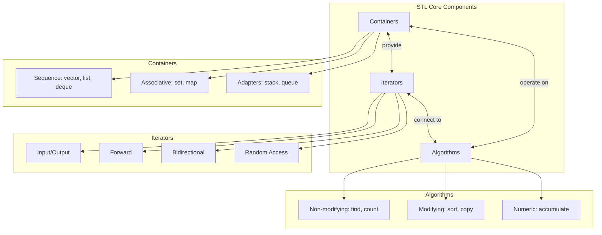

### Iterator Hierarchy

```mermaid
graph BT
    Input[Input Iterator<br/>read, ++]
    Output[Output Iterator<br/>write, ++]
    Forward[Forward Iterator<br/>read/write, ++]
    Bidirectional[Bidirectional Iterator<br/>read/write, ++, --]
    RandomAccess[Random Access Iterator<br/>read/write, ++, --, +n, -n, []]

    Input --> Forward
    Output --> Forward
    Forward --> Bidirectional
    Bidirectional --> RandomAccess

    style RandomAccess fill:#90EE90
    style Bidirectional fill:#87CEEB
    style Forward fill:#DDA0DD
```

**Container Iterator Types:**
| Container | Iterator Type |
|-----------|---------------|
| `vector` | Random Access |
| `deque` | Random Access |
| `list` | Bidirectional |
| `set/map` | Bidirectional |
| `stack/queue` | None (adapters) |

---

## STL Architecture

### How Algorithms Connect to Containers

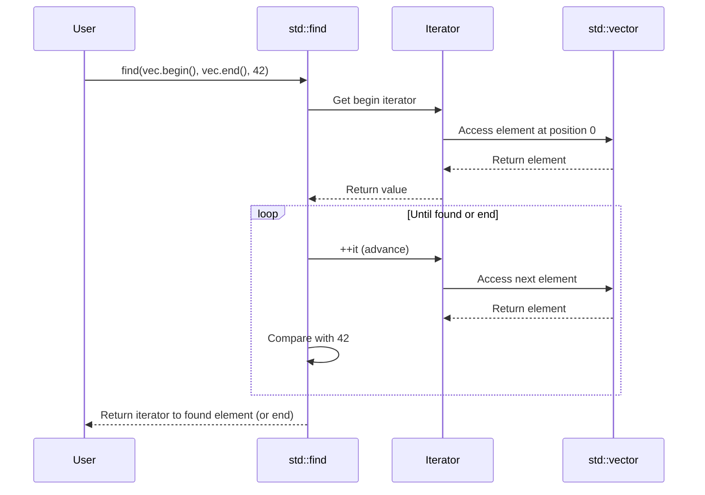

### Template Mechanism

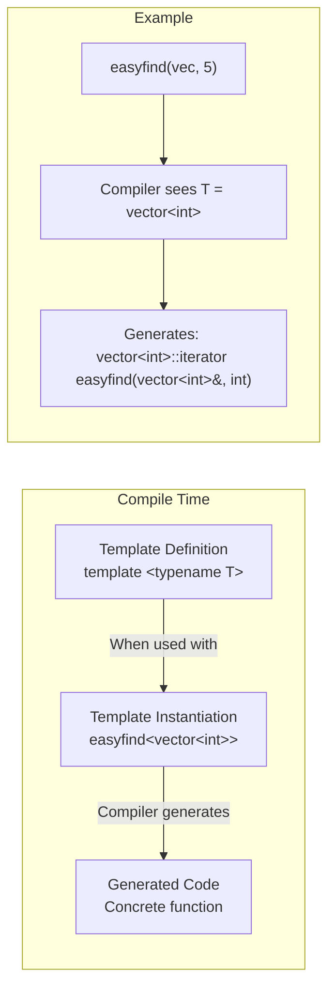

---

## Exercise 00: easyfind

### Concept Map

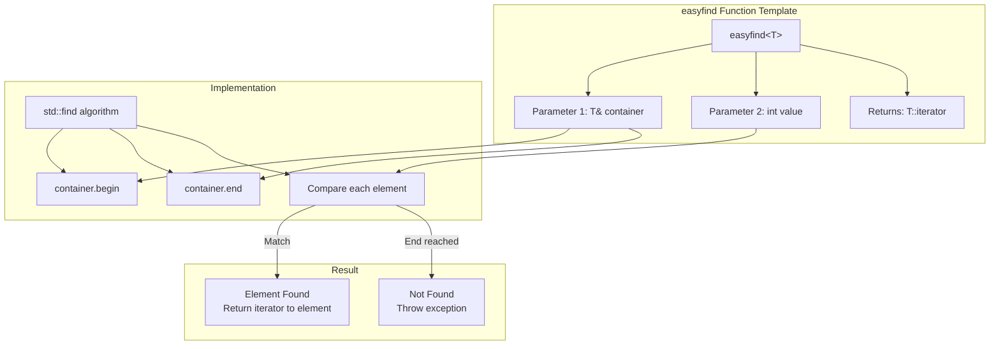

### Code Flow

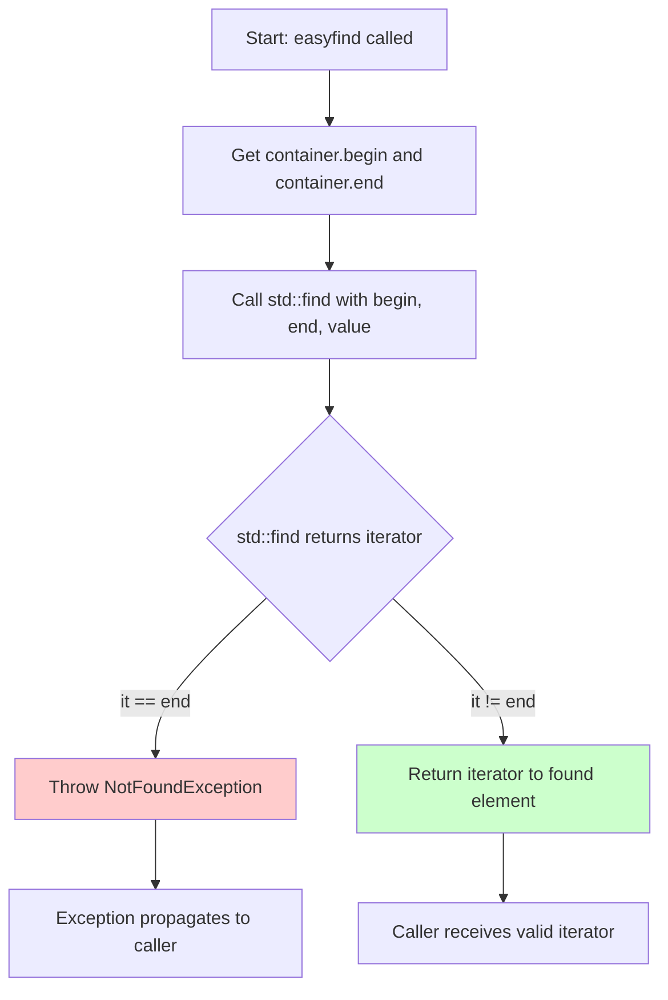

### Why Use std::find?

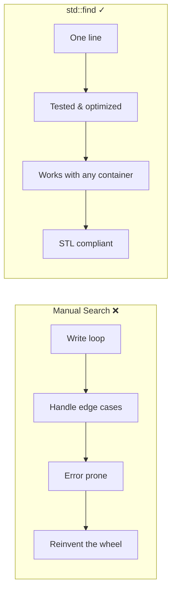

---

## Exercise 01: Span

### Class Architecture

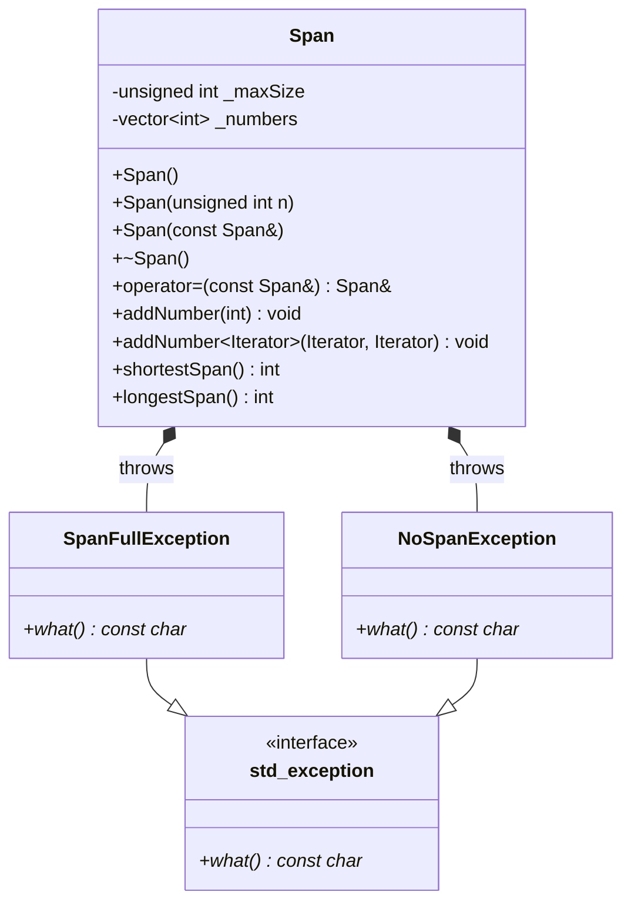

### shortestSpan Algorithm

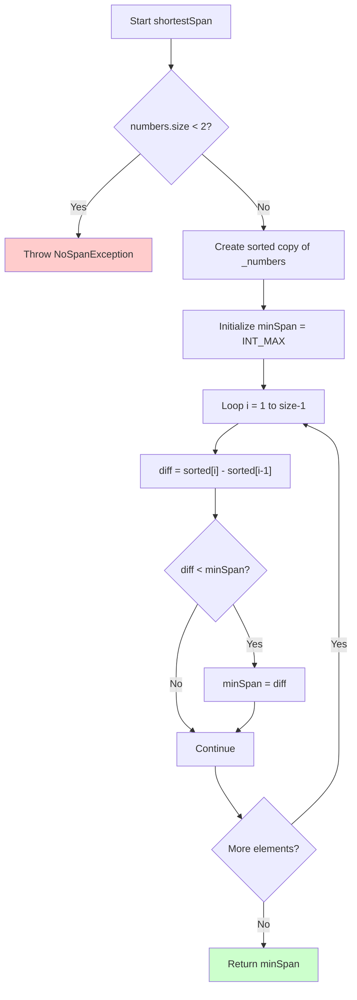

### Why Sort for Shortest Span?

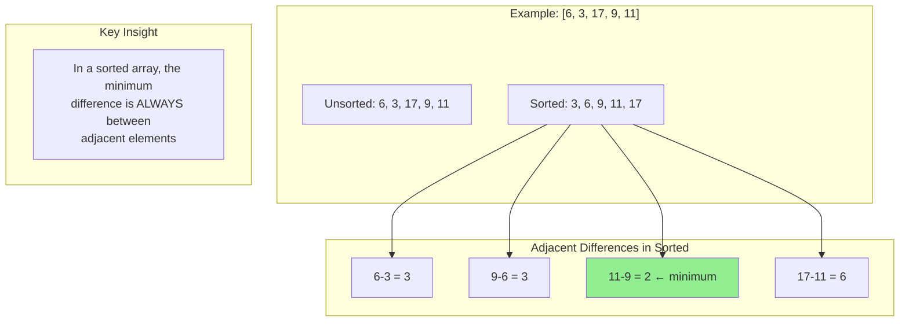

### longestSpan Algorithm

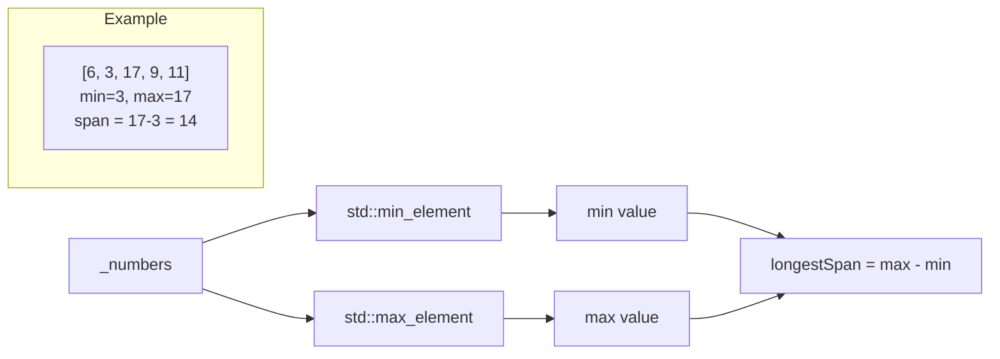

### Range-based addNumber

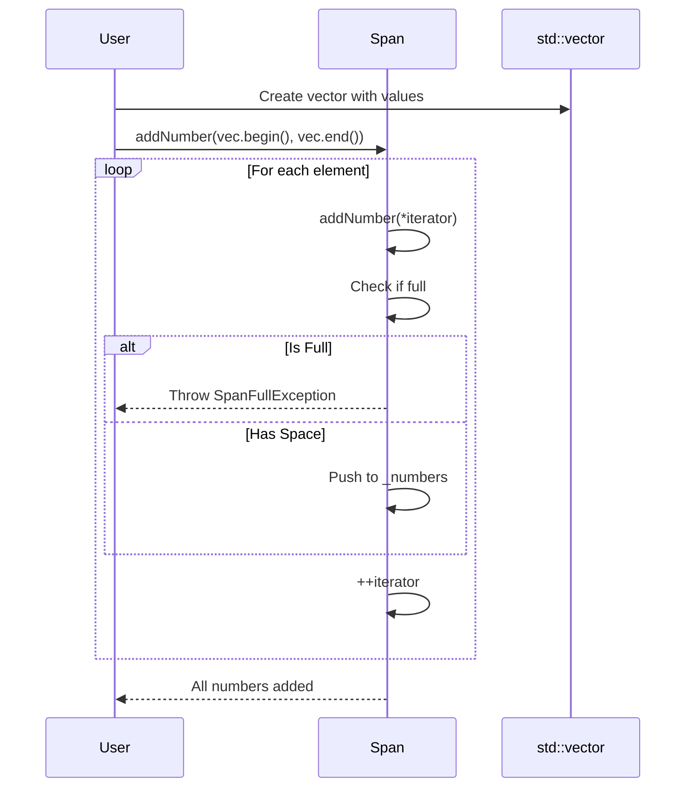

---

## Exercise 02: MutantStack

### Inheritance Architecture

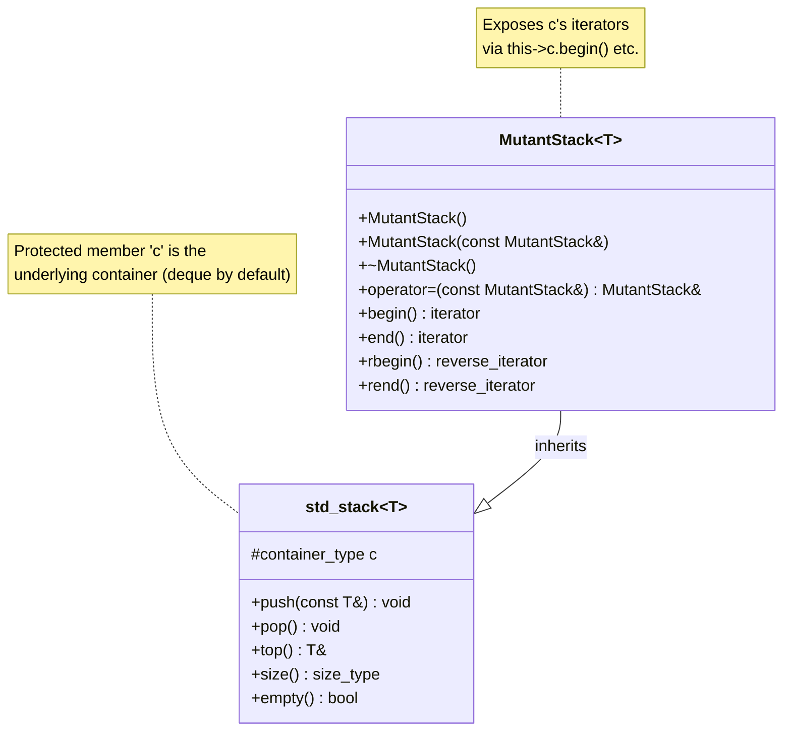

### How std::stack Works Internally

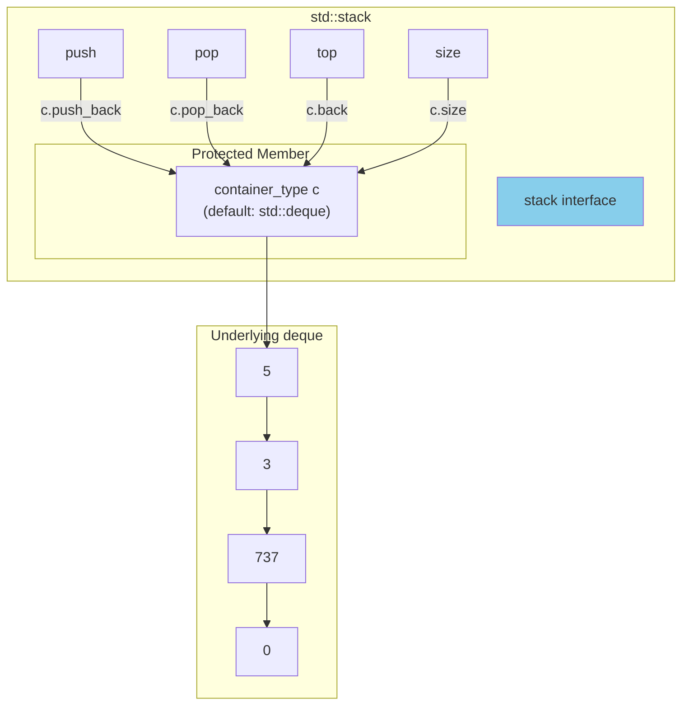

### MutantStack Iterator Access

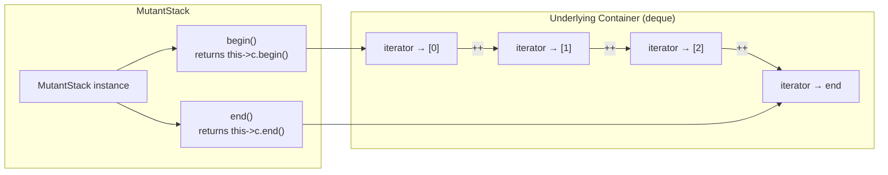

### Comparison: stack vs MutantStack vs list

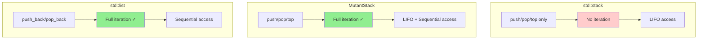

### Type Definitions Explained

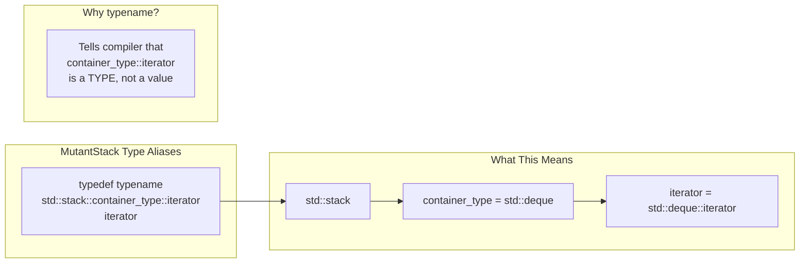

---

## Key Takeaways

### Mental Model: STL Design Philosophy

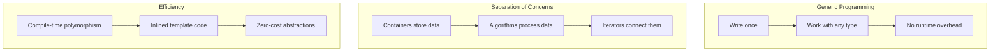

### Summary Table

| Exercise | Key Concept | STL Components Used |
|----------|-------------|---------------------|
| ex00 | Function templates + Algorithms | `std::find`, iterators |
| ex01 | Class design + Algorithms | `std::vector`, `std::sort`, `std::min_element`, `std::max_element` |
| ex02 | Inheritance + Container adapters | `std::stack`, underlying container iterators |

### Common Pitfalls to Avoid

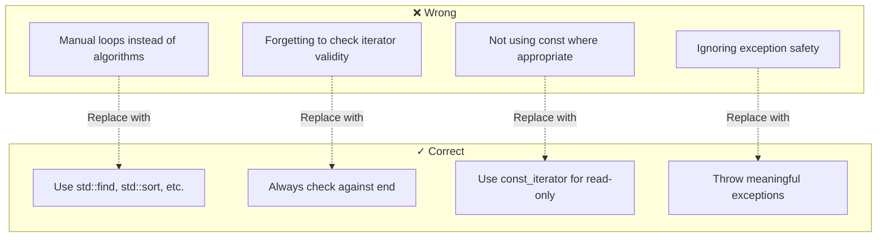

---

## Memory Layout Visualization

### Span Internal Structure

```
Span object (stack)
┌─────────────────────────────────┐
│ _maxSize: unsigned int (4 bytes)│
├─────────────────────────────────┤
│ _numbers: std::vector<int>      │
│   ┌─────────────────────────┐   │
│   │ pointer to data (heap)  │───┼──► [3, 6, 9, 11, 17] (heap)
│   │ size: 5                 │   │
│   │ capacity: 8             │   │
│   └─────────────────────────┘   │
└─────────────────────────────────┘
```

### MutantStack Internal Structure

```
MutantStack<int> (inherits from std::stack<int>)
┌─────────────────────────────────────────┐
│ std::stack<int> base                    │
│   ┌─────────────────────────────────┐   │
│   │ c: std::deque<int> (protected)  │   │
│   │   ┌─────────────────────────┐   │   │
│   │   │ chunk pointers          │───┼───┼──► [5, 3, 737, 0]
│   │   │ size: 4                 │   │   │
│   │   └─────────────────────────┘   │   │
│   └─────────────────────────────────┘   │
│ (no additional members)                 │
└─────────────────────────────────────────┘

Iterator points into the deque's internal storage
begin() → [5]  (first element)
end()   → [past 0] (one past last)
```

---

## Quick Reference Card

```
┌────────────────────────────────────────────────────────────────┐
│                    MODULE 08 CHEAT SHEET                       │
├────────────────────────────────────────────────────────────────┤
│ EASYFIND:                                                      │
│   std::find(container.begin(), container.end(), value)         │
│   Returns: iterator to element or end() if not found           │
├────────────────────────────────────────────────────────────────┤
│ SPAN:                                                          │
│   shortestSpan: sort → find min adjacent difference            │
│   longestSpan:  max_element - min_element                      │
│   Range add:    template<Iterator> addNumber(begin, end)       │
├────────────────────────────────────────────────────────────────┤
│ MUTANTSTACK:                                                   │
│   Inherit from std::stack<T>                                   │
│   Access underlying container: this->c                         │
│   Expose iterators: this->c.begin(), this->c.end()            │
├────────────────────────────────────────────────────────────────┤
│ ITERATOR TYPES:                                                │
│   typename T::iterator              (modifiable)               │
│   typename T::const_iterator        (read-only)                │
│   typename T::reverse_iterator      (backwards)                │
└────────────────────────────────────────────────────────────────┘
```
