# Module 09: STL - Deep Analysis

## Table of Contents
1. [Module Overview](#module-overview)
2. [Container Strategy](#container-strategy)
3. [Exercise 00: Bitcoin Exchange](#exercise-00-bitcoin-exchange)
4. [Exercise 01: RPN Calculator](#exercise-01-rpn-calculator)
5. [Exercise 02: PmergeMe (Ford-Johnson)](#exercise-02-pmergeme)
6. [Key Concepts Summary](#key-concepts-summary)

---

## Module Overview

```mermaid
mindmap
  root((Module 09: STL))
    Containers Used
      std::map
        Associative Container
        Key-Value Pairs
        Ordered by Key
        O(log n) lookup
      std::stack
        Container Adapter
        LIFO Structure
        push/pop/top
        O(1) operations
      std::vector
        Sequence Container
        Dynamic Array
        Random Access
        O(1) access
      std::deque
        Sequence Container
        Double-ended Queue
        Fast front/back
        O(1) at ends
    Core Concepts
      Iterator Patterns
      Algorithm Complexity
      Container Selection
      Memory Management
    Exercises
      ex00: Bitcoin Exchange
      ex01: RPN Calculator
      ex02: Merge-Insert Sort
```

---

## Container Strategy

The module requires using **different containers for each exercise**. Here's the rationale:

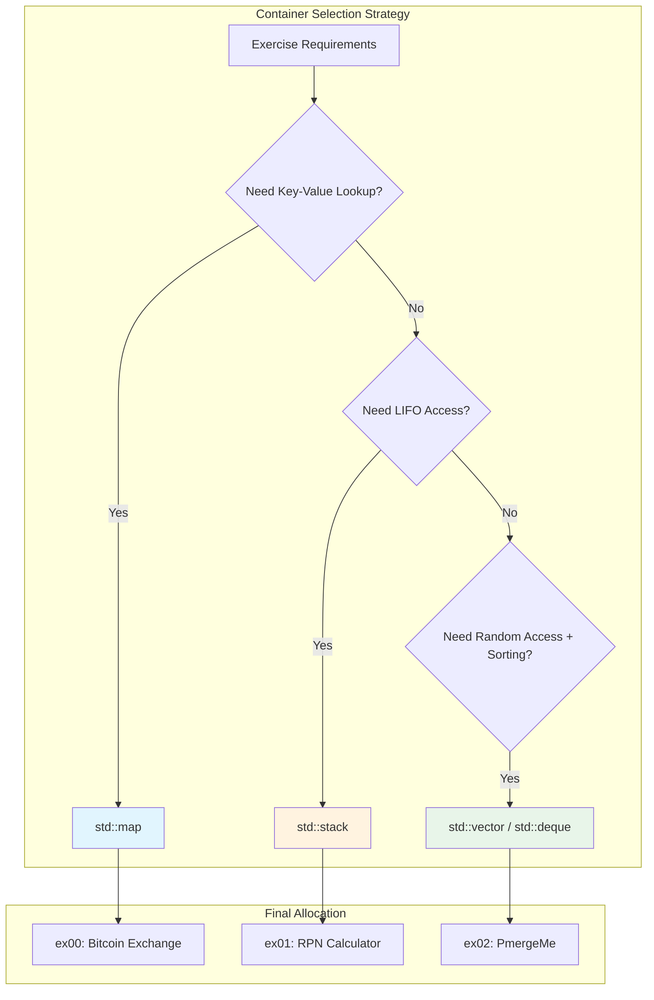

### Why These Containers?

| Exercise | Container | Reason |
|----------|-----------|--------|
| ex00 | `std::map` | Need date→price mapping with efficient lookup by date. `lower_bound()` finds nearest lower date in O(log n) |
| ex01 | `std::stack` | RPN evaluation naturally uses LIFO - push operands, pop for operations |
| ex02 | `std::vector` + `std::deque` | Need random access for binary search insertion. Compare performance between contiguous (vector) and segmented (deque) memory |

---

## Exercise 00: Bitcoin Exchange

### Architecture

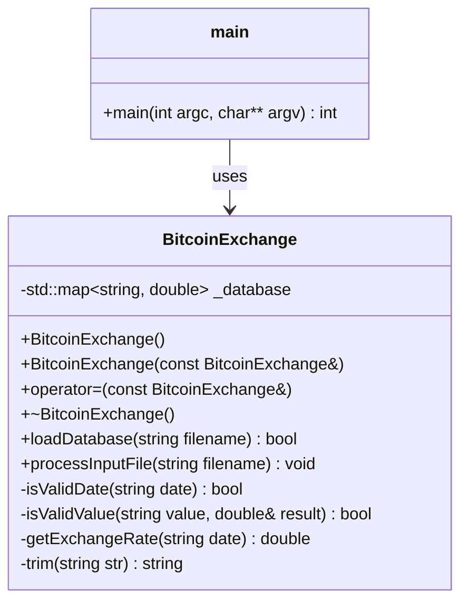

### Data Flow

```mermaid
flowchart TD
    subgraph "Initialization"
        A[Program Start] --> B[Load data.csv]
        B --> C{File Exists?}
        C -->|No| D[Error: could not open database]
        C -->|Yes| E[Parse CSV lines]
        E --> F[Store in std::map<br/>key=date, value=rate]
    end

    subgraph "Processing Input"
        F --> G[Open input file]
        G --> H{Read Line}
        H -->|EOF| I[End]
        H -->|Line| J{Valid Format?<br/>date \| value}
        J -->|No| K[Error: bad input]
        K --> H
        J -->|Yes| L{Valid Date?<br/>YYYY-MM-DD}
        L -->|No| M[Error: bad input]
        M --> H
        L -->|Yes| N{Valid Value?<br/>0 ≤ v ≤ 1000}
        N -->|< 0| O[Error: not positive]
        N -->|> 1000| P[Error: too large]
        N -->|Valid| Q[Get Exchange Rate]
        O --> H
        P --> H
    end

    subgraph "Rate Lookup"
        Q --> R{Exact Date<br/>in Database?}
        R -->|Yes| S[Use exact rate]
        R -->|No| T[Find lower_bound]
        T --> U{Date before<br/>first entry?}
        U -->|Yes| V[Error: date too early]
        U -->|No| W[Use previous date's rate]
        S --> X[Calculate: value × rate]
        W --> X
        X --> Y[Output Result]
        Y --> H
        V --> H
    end

    style F fill:#e1f5fe
    style Q fill:#fff9c4
```

### std::map Operations Explained

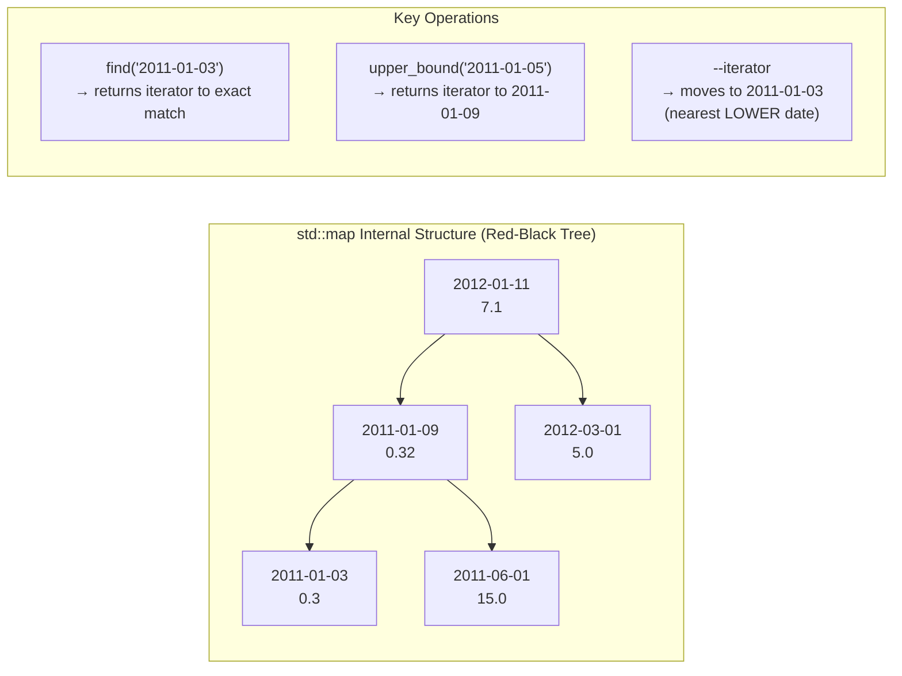

### Date Validation Logic

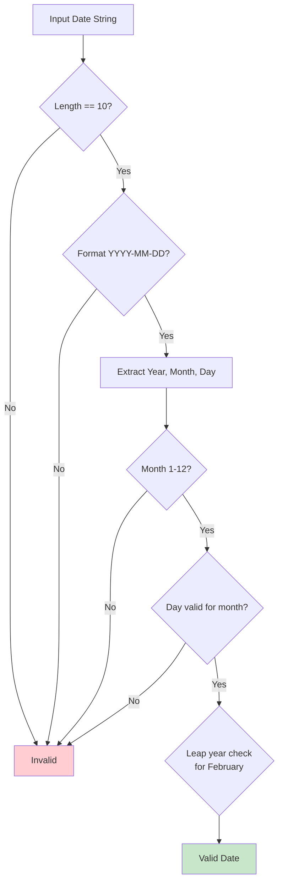

---

## Exercise 01: RPN Calculator

### Architecture

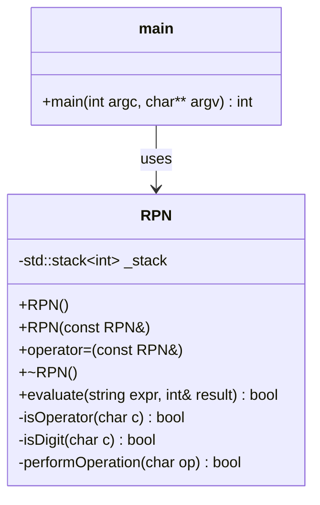

### RPN Evaluation Algorithm

```mermaid
flowchart TD
    A[Input: "8 9 * 9 - 9 - 9 - 4 - 1 +"] --> B[Initialize Empty Stack]
    B --> C[Read Next Token]
    C --> D{Token Type?}

    D -->|Digit| E[Push to Stack]
    E --> C

    D -->|Operator| F[Pop Two Operands]
    F --> G{Stack has ≥ 2?}
    G -->|No| H[Error: Invalid Expression]
    G -->|Yes| I[Perform Operation]
    I --> J[Push Result]
    J --> C

    D -->|Space| C

    D -->|End of Input| K{Stack Size == 1?}
    K -->|No| H
    K -->|Yes| L[Return Top as Result]

    D -->|Other| H

    style L fill:#c8e6c9
    style H fill:#ffcdd2
```

### Stack Visualization: "8 9 * 9 -"

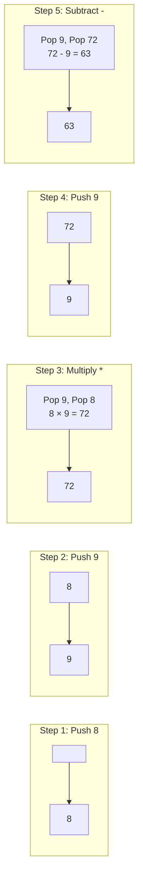

### Why std::stack?

```mermaid
flowchart TB
    subgraph "std::stack Properties"
        A[LIFO: Last In First Out]
        B[O(1) push/pop/top]
        C[No iteration needed]
        D[Perfect for expression evaluation]
    end

    subgraph "RPN Requirements"
        E[Push operands as encountered]
        F[Pop two operands for each operator]
        G[Push result back]
        H[Final result is last remaining element]
    end

    A -.-> E
    B -.-> F
    B -.-> G
    C -.-> H
```

---

## Exercise 02: PmergeMe

### Architecture

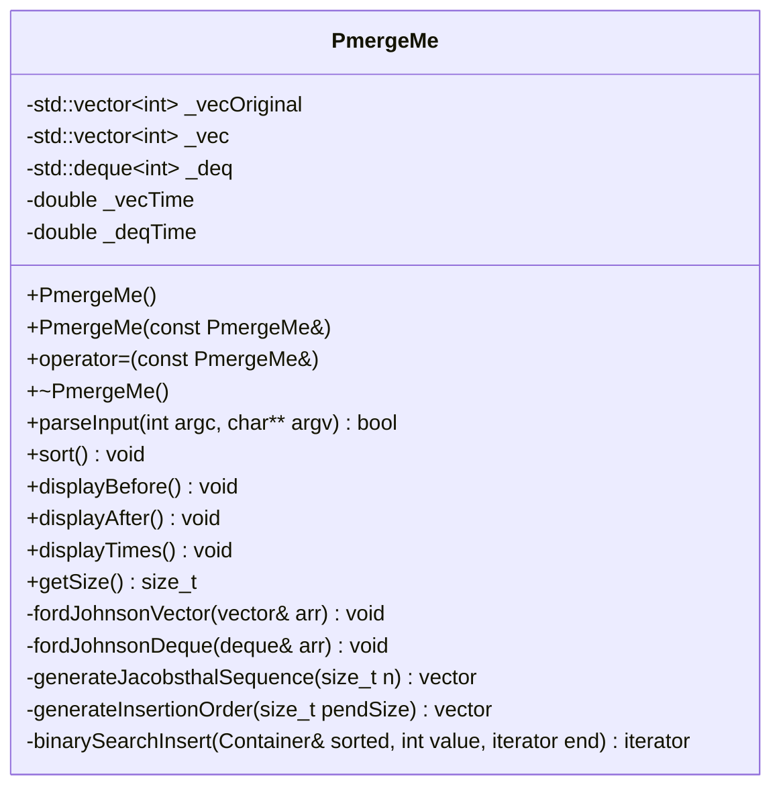

### Ford-Johnson Algorithm Overview

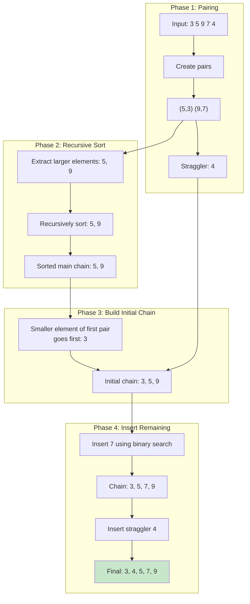

### Ford-Johnson Detailed Flow

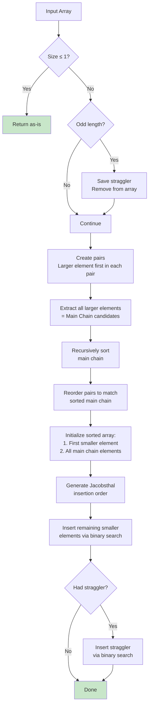

### Jacobsthal Numbers & Insertion Order

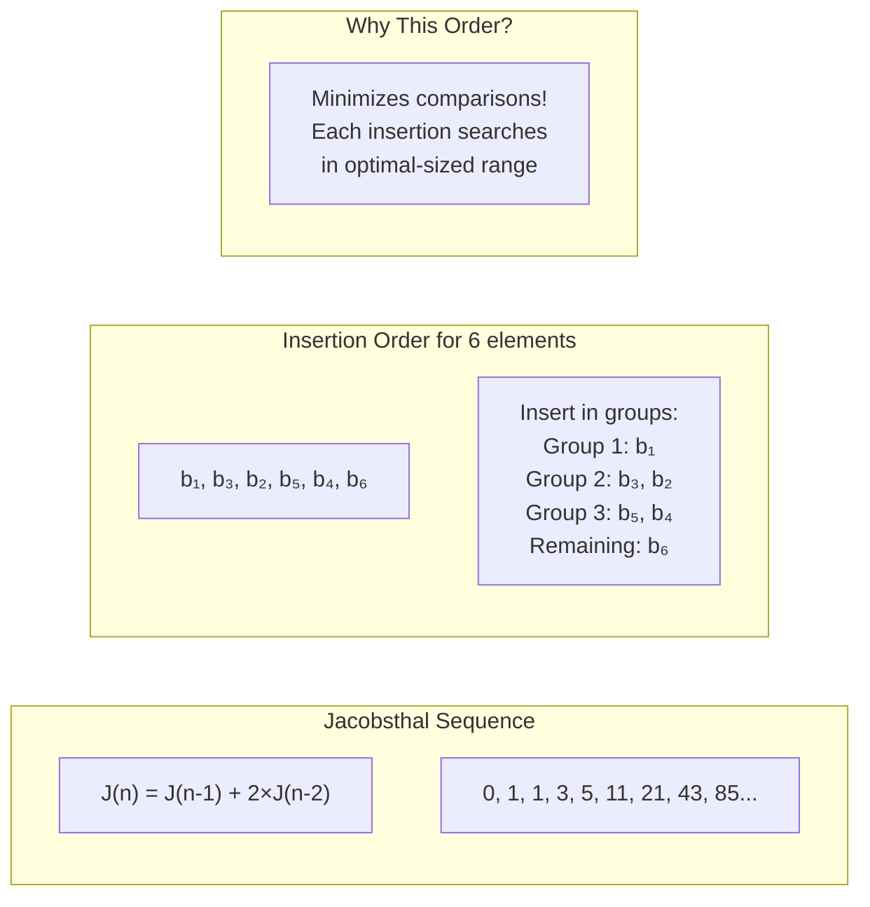

### Binary Search Insertion

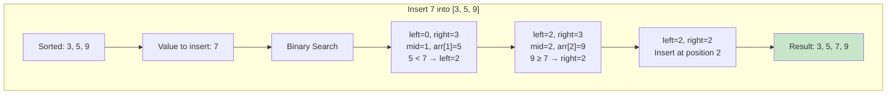

### Vector vs Deque Performance

```mermaid
flowchart TB
    subgraph "std::vector"
        V1[Contiguous Memory]
        V2[Cache-Friendly]
        V3[O(n) insertion in middle]
        V4[Fast random access]
        V1 --> V5["Better for:<br/>- Iteration<br/>- Binary search<br/>- Small to medium data"]
    end

    subgraph "std::deque"
        D1[Segmented Memory]
        D2[Less cache-friendly]
        D3[O(n) insertion in middle]
        D4[O(1) front/back insertion]
        D1 --> D5["Better for:<br/>- Frequent front insertion<br/>- Very large data<br/>- No reallocation"]
    end

    subgraph "For Ford-Johnson"
        RESULT["Vector typically faster<br/>due to cache locality<br/>during binary search"]
    end

    V5 --> RESULT
    D5 --> RESULT
```

### Complete Example: Sorting [3, 5, 9, 7, 4]

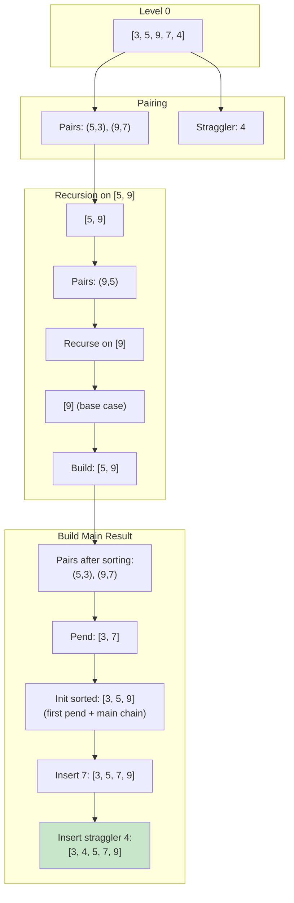

---

## Key Concepts Summary

### STL Container Hierarchy

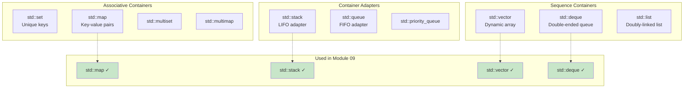

### Complexity Comparison

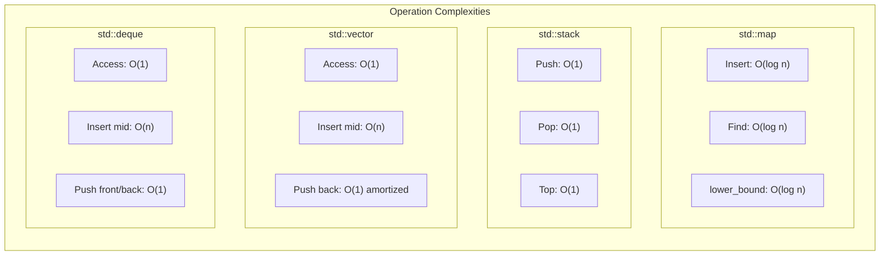

### Orthodox Canonical Form

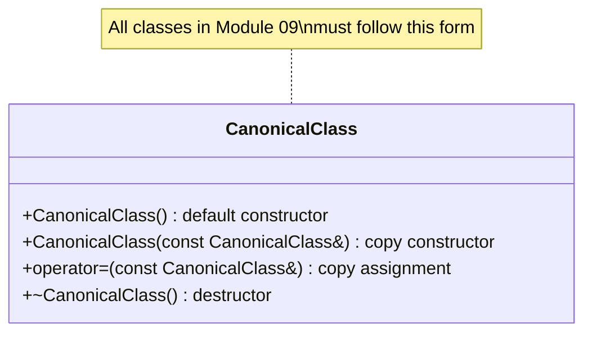

---

## Memory Layout Visualization

### std::map (Red-Black Tree)

```
                    [2012-01-11: 7.1]
                   /                 \
        [2011-06-01: 15.0]    [2013-01-01: 13.5]
        /            \
[2011-01-03: 0.3]  [2011-09-01: 5.0]

- Balanced binary search tree
- Each node: key + value + color + pointers
- O(log n) guaranteed for all operations
```

### std::vector vs std::deque

```
std::vector:
┌───┬───┬───┬───┬───┬───┬───┬───┐
│ 3 │ 5 │ 9 │ 7 │ 4 │   │   │   │  ← Contiguous memory
└───┴───┴───┴───┴───┴───┴───┴───┘
  ↑                   ↑       ↑
 begin               size  capacity


std::deque:
┌─────────┐   ┌─────────┐   ┌─────────┐
│ Block 0 │ → │ Block 1 │ → │ Block 2 │  ← Segmented memory
│ [3,5,9] │   │ [7,4,_] │   │ [_,_,_] │
└─────────┘   └─────────┘   └─────────┘
      ↑
   Central map of pointers
```

---

## Testing Checklist

### ex00: Bitcoin Exchange
- [ ] Empty file handling
- [ ] Invalid date formats (2001-42-42)
- [ ] Negative values
- [ ] Values > 1000
- [ ] Date before database start
- [ ] Missing pipe separator
- [ ] Correct lower-bound date lookup

### ex01: RPN
- [ ] Basic operations: `8 9 * 9 - 9 - 9 - 4 - 1 +` → 42
- [ ] Division: `7 7 * 7 -` → 42
- [ ] Complex: `1 2 * 2 / 2 + 5 * 6 - 1 3 * - 4 5 * * 8 /` → 15
- [ ] Parentheses rejection: `(1 + 1)` → Error
- [ ] Division by zero handling
- [ ] Invalid tokens

### ex02: PmergeMe
- [ ] Small input: `3 5 9 7 4` → `3 4 5 7 9`
- [ ] Negative numbers → Error
- [ ] Large input (3000 elements)
- [ ] Timing displayed correctly
- [ ] Both containers produce same result

---

## Further Reading

1. **Ford-Johnson Algorithm**: "The Art of Computer Programming, Vol. 3" by Donald Knuth, Section 5.3.1
2. **Jacobsthal Numbers**: OEIS A001045
3. **STL Containers**: cppreference.com
4. **Red-Black Trees**: Introduction to Algorithms (CLRS), Chapter 13
